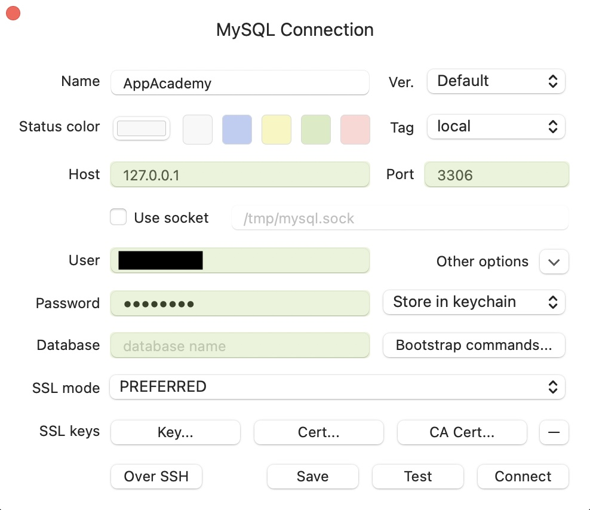
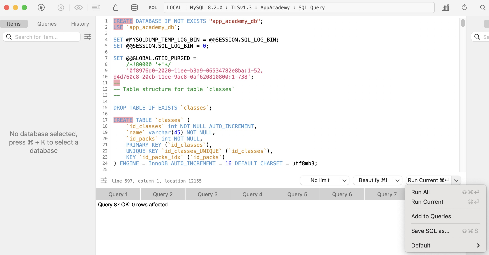
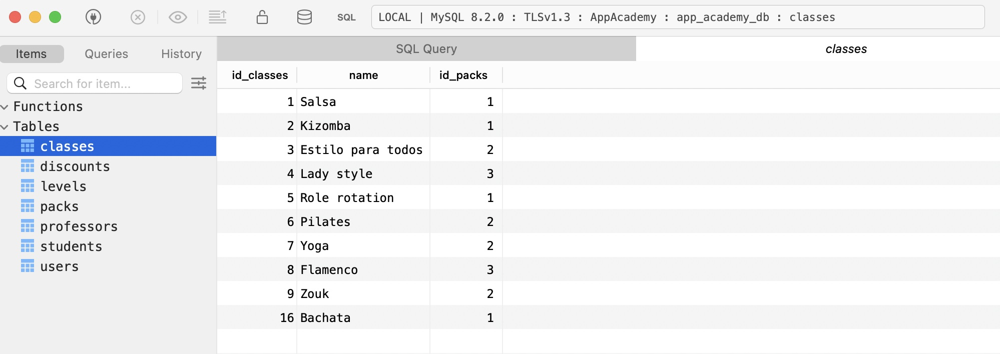
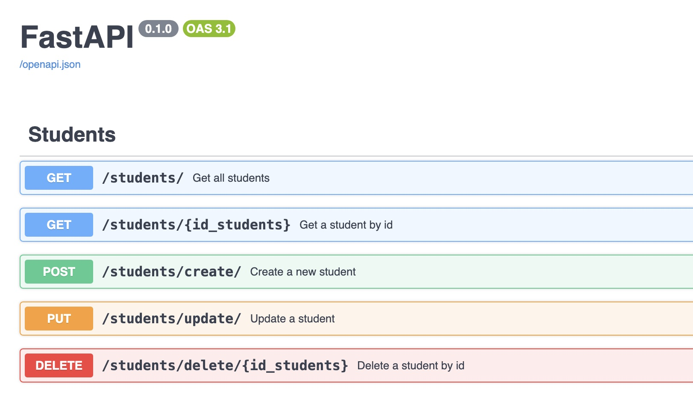

<div align="right">

# **AppAcademy**

</div>


<br />

## 📄 Description

<p align="justify">
AppAcademy is a comprehensive Management Solution for Dance Schools. Our mission is to provide a modern and efficient solution to dance schools, allowing them to manage all aspects related to their students, teachers, classes and registrations in an agile and organized manner.</p>

<p align="justify">
This project focuses on a backend solution, through the implementation of a database capable of managing the registrations of new students, teachers, classes, discounts, and dance sessions. The project is loaded with some example data that you can initialize to see how it works, or skip it and enter the information you consider necessary.
</p>

<br />

## 🧠 Tech Stack


<br />

## 🚀 Demo 🔥

[Demo](https://app-academy.onrender.com/)

<br />

## ⚙️ Installation

**Follow the instructions to start the application**

<p style="color: #576E9D">Clone this repo</p>

```
git clone https://github.com/kamilodev/AppAcademy.git
```

<p style="color: #576E9D">Go to the project directory and create your virtual environment</p>

```
cd AppAcademy
python -m venv venv
```

<p style="color: #576E9D">Installing dependencies according to your environment manager</p>

```
pip install -r requirements.txt
pipenv install
```

<div align="justify">
<p style="color: #576E9D">Rename the .env.example file to .env and edit the environment variables with the actual data of your local or remote MySQL database connection.</p>

<p style="color: #576E9D">The variable named MYSQL_ADDON_DB is the name of the database you will use for the project, set the name equal to the name that appears in lines 1 and 2 of the app_academy_db.sql file. If you do not want to change the default name which is app_academy_db, set this variable with this name.</p>

<p style="color: #576E9D">Open your Database Manager and connect to a local or remote server. At this point you don't need to have the database created, just test the connection and it is correct, note that the database field is empty for now.</p>
<br>



<br>
<p style="color: #576E9D">Once you have connected correctly, you must open the query editor, open the file app_academy_db.sql, copy all its content, paste it inside the editor, and execute all the queries, this will create the database, tables, and initial data.</p>

<p style="color: #576E9D">Remember that this is the same process to do it in a Cloud database.</p>
<br>



<br>
<p style="color: #576E9D">Great! You now have a working database</p>
<br>



<br>
<p style="color: #576E9D">Now it is time to set up our FastAPI server.</p>

<p style="color: #576E9D">Open a terminal and activate your virtual environment, then run the following command:</p>

```
uvicorn App:app --reload
```

</br>
<p style="color: #576E9D">If everything went well, you should see the following message:</p>

```
INFO:     Uvicorn running on http://127.0.0.1:8000 (Press CTRL+C to quit)
```

</br>
<p style="color: #576E9D">Open your browser and go to the following address:</p>

```
http://127.0.0.1:8000/docs
```

</br>
<p style="color: #576E9D">If your ip address is different, replace it with the one that appears in the terminal, and add /docs to the end</p>

<p style="color: #576E9D">You should see the following page, here, you will can interact with all endpoints, read, write, update, or delete info</p>

</br>

</br>
</div>

<br />

## 📌 Features

<div align="justify">

-   [x] Backend application with MySQL and FastAPI.

-   [x] Complete CRUD system for categories, students, teachers, classes, enrollments, courses, levels, users, and discounts.

-   [x] Teachers can belong to one or several classes, in one or several levels.

-   [x] Discounts are offered if there are two or more classes belonging to the same pack, if the student enrolls in more than one of the same teacher's courses, or if a family member also enrolls in the academy.

-   [x] Each student can have only one enrollment, but be enrolled in as many classes and levels as he/she wants.

-   [x] Each student has a status as active or inactive, so, if you no longer take classes you will be inactive, but your data will remain in the database of the academy in case you want to resume your classes someday.

</div>

<br />

## 📖 View documentation

[Docu Notion](https://jelly-tomato-cb6.notion.site/6c11548b28a34c3f884c5e83c607600b?v=f839aa368bfa4b87ac1c59ea6f27d557&pvs=4)

<br />

## 👨🏻‍💻 Authors

<table>
  <tr>
    <td align="center">
    <a href="https://github.com/CGP20" target="_blank"><br /><sub><b>Carol</b></sub>
    </td>
    <td align="center">
    <a href="https://github.com/luisdavidtribino" target="_blank"><br /><sub><b>David</b></sub></a>
    </td>
    <td align="center">
    <a href="https://github.com/Vert-ix" target="_blank"><br /><sub><b>Berta</b></sub></a>
    </td>
    <td align="center">
    <a href="https://github.com/kamilodev" target="_blank"><br /><sub><b>Kamilo</b></sub></a>
    </td>
    </tr>
</table>

<br>

## License

[](https://choosealicense.com/licenses/mit/)


